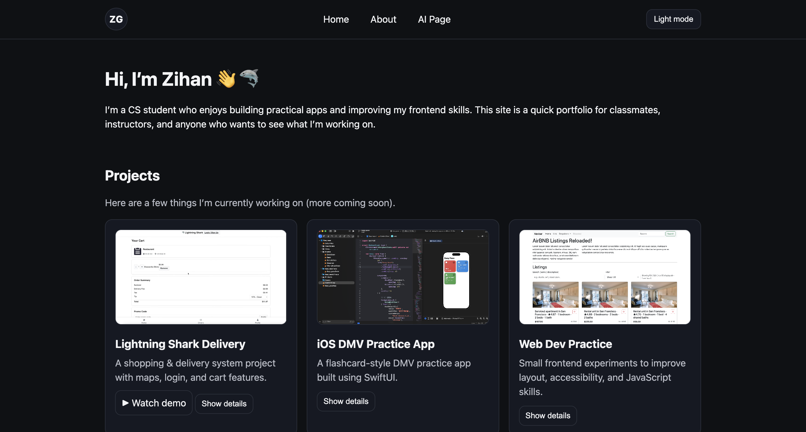

# Web Development Project 1 — Personal Homepage

## Author

Zihan Guo

## Live Site

https://zihanguo1204.github.io/web-dev-project1/

## Design Document
- Google Doc: https://docs.google.com/document/d/1ADSZYyJPuW_JrrzhJNGq2aUSpzz48Xry-OgA-frH2IE/edit?usp=sharing

## Project Objective

A personal homepage built with vanilla HTML, CSS, and JavaScript (ES6 modules).  
The goal is to introduce who I am and showcase a few projects I’m working on.

## Pages

- index.html — Home
- about.html — About
- ai.html — AI Page

## Features

- Light/Dark mode toggle (saved with localStorage)
- Expandable project details
- Click-to-zoom project screenshots (lightbox)
- Project demo link for Lightning Shark Delivery

## Screenshot



## How to Run Locally

Open the folder in VS Code and run `index.html` with Live Server.

Optional formatting + lint:

```bash
npm install
npm run format
npm run lint

## GenAI Usage
I used ChatGPT as a learning assistant while building this project. I mainly used it to
ask questions, troubleshoot bugs, and get suggestions for organizing my code. I did the
final implementation and edits myself to match the rubric and my own design choices.

- Tool: ChatGPT (OpenAI)
- How it was used:
  - Clarified how to structure a simple portfolio layout with semantic HTML
  - Helped me debug small CSS/JS issues (dark mode colors, button behavior, image preview)
  - Suggested ways to keep code organized (separate folders, reusable classes)
  - Helped me rewrite short text content to be clearer

Example prompts I used:
- “Why is my dark mode text hard to read, and what CSS variables should I adjust?”
- “How can I open an image in a larger preview using plain JavaScript (no libraries)?”
- “Can you suggest a clean file structure for HTML/CSS/JS/assets in a small project?”
```
